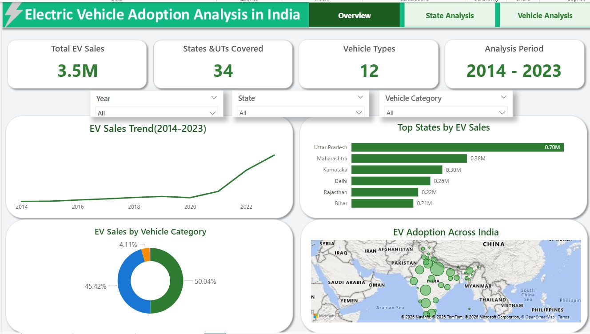
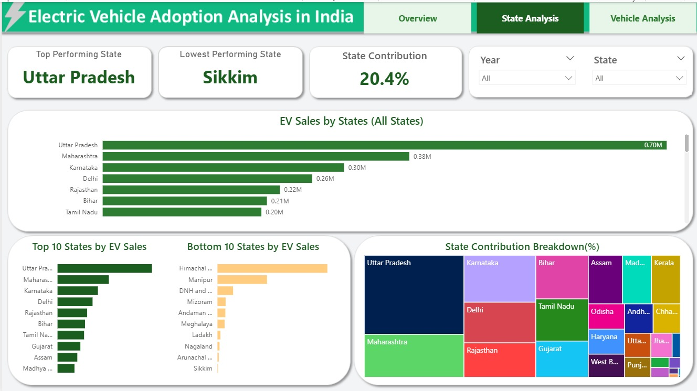
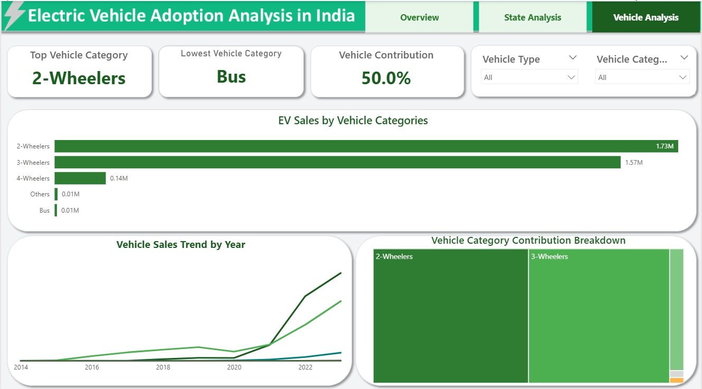
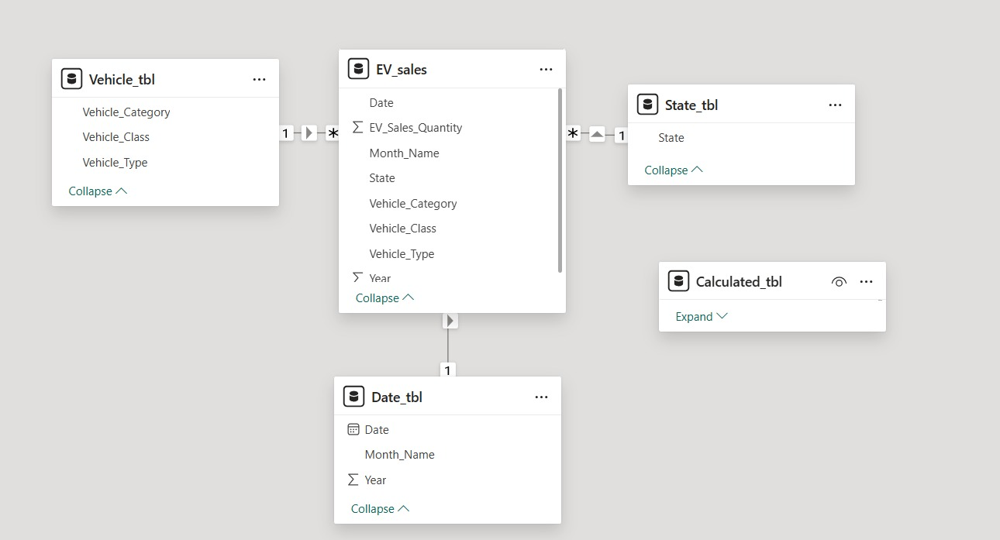

# EV-Sales--Analysis-India
An interactive Power BI dashboard analyzing electric vehicle adoption and sales trends across Indian states.
# Electric Vehicle Adoption Analysis in India

## 📌 Project Overview
This project analyzes Electric Vehicle (EV) sales and adoption trends across Indian states from 2014 to 2023 using Power BI.

The dashboard provides insights into EV sales growth, state-wise performance, and vehicle category contributions.

## 🛠️ Tools & Technologies
- Power BI
- Excel
- Power Query
- DAX
- Data Cleaning
- Data Modeling
- Data Visualization

## 📊 Dashboard Pages

### 1. Overview

### 2. State Analysis

### 3. Vehicle Analysis

## 🗂️ Data Model
The data model uses a central EV sales table connected to Date, State, and Vehicle dimension tables.

## 🔍 Key Insights
- Total EV sales in the dataset are approximately 3.5 million.
- Uttar Pradesh is the leading state by EV sales.
- Sikkim has the lowest sales among the states in the analysis.
- Two-wheelers contribute approximately 50% of total EV sales.
- EV adoption increased significantly after 2021.

## 📅 Analysis Period
2014–2023

## 👩‍💻 Author
Athira Mohan

Data Analyst | Power BI | SQL | Python | Excel

## 📄 Project Presentation

[View EV Sales Project Presentation](EV-Project-Presentation.pdf)
